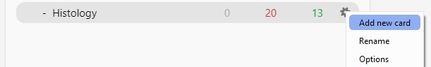

<h1 align="center">
	AnkiNewCardBtn
</h1>
<h2 align="center">
	Adds a "Create New Card" shortcut button to the Main Window.
</h2>

	

Before, If you needed to add a new card in another deck, you have to :
1. Click `Decks` to go back to the deck list.
2. Click on a Deck to open it (which takes time to load the deck).
3. Click 'Add' to open the note editor.

With this addon, you can do that right from the deck list. Just :
1. Click 'Add new card' to open the note editor.

This saves time and the hassle of going back and forth if you add cards to multiple decks (like me).

## Installation

- #### Automatic install

Simply install [the addon](https://ankiweb.net/shared/info/34932092) on your AnkiDesktop.
